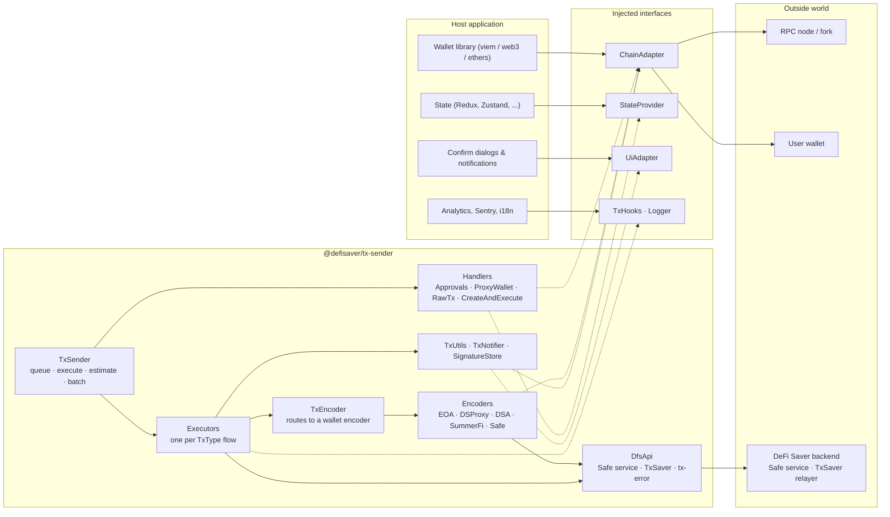
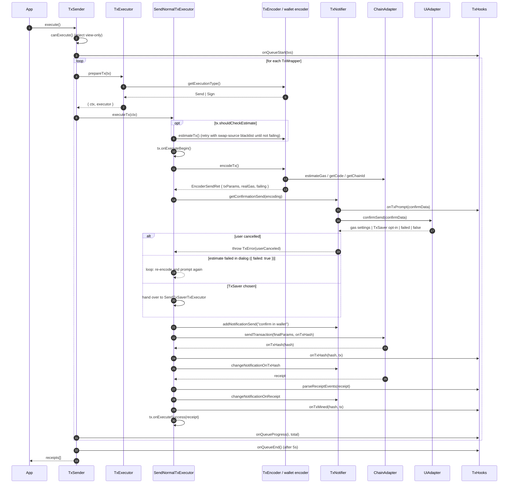
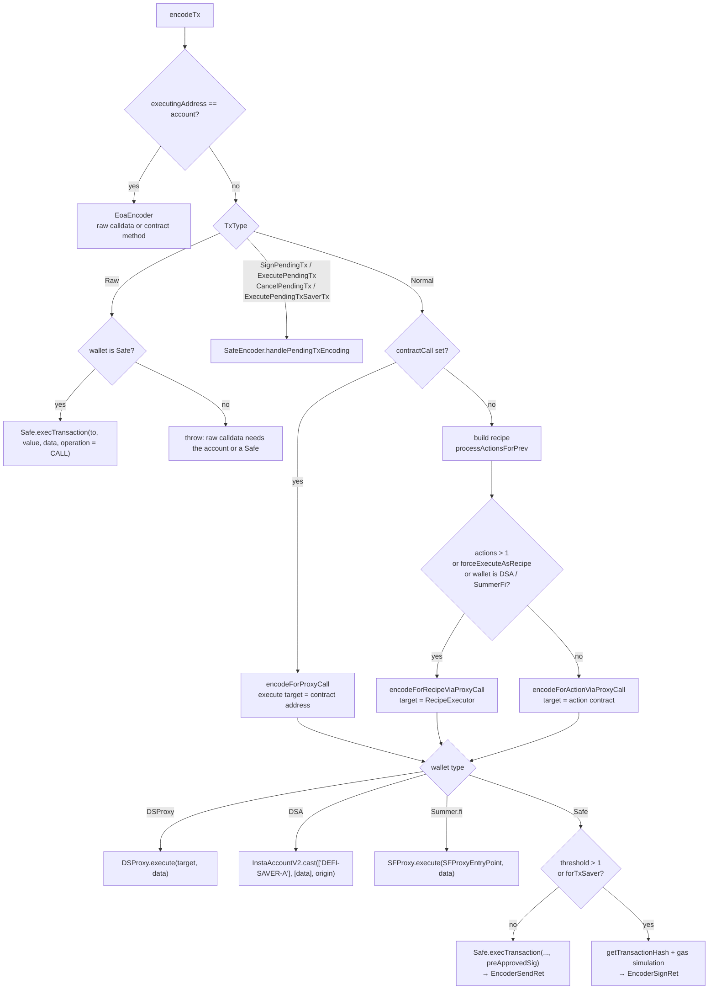
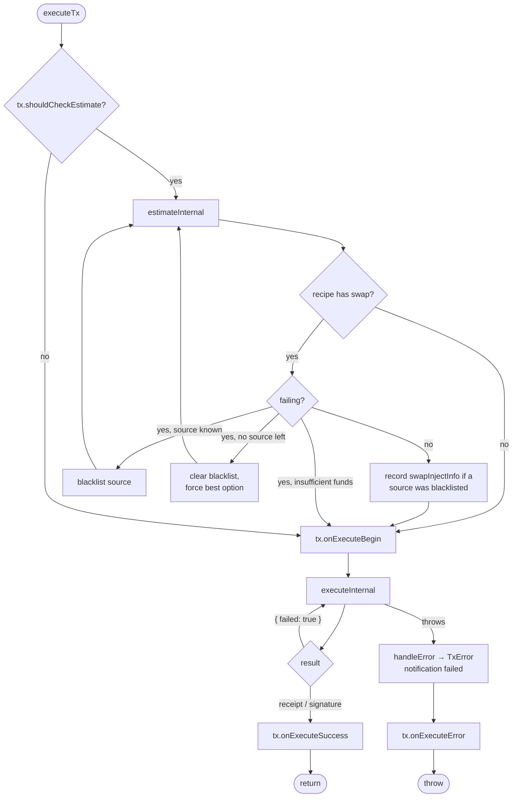
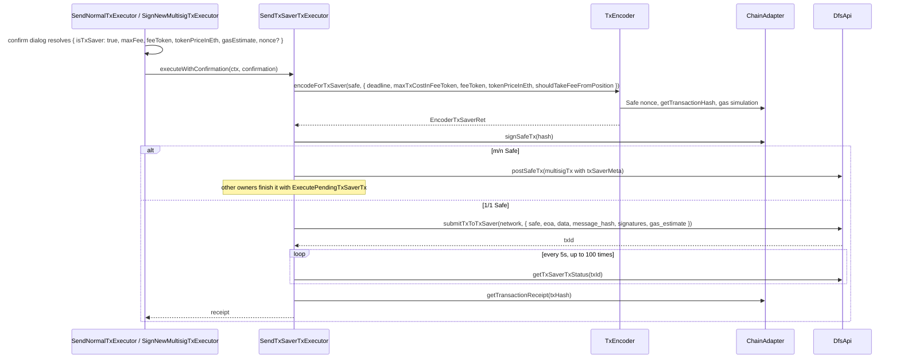
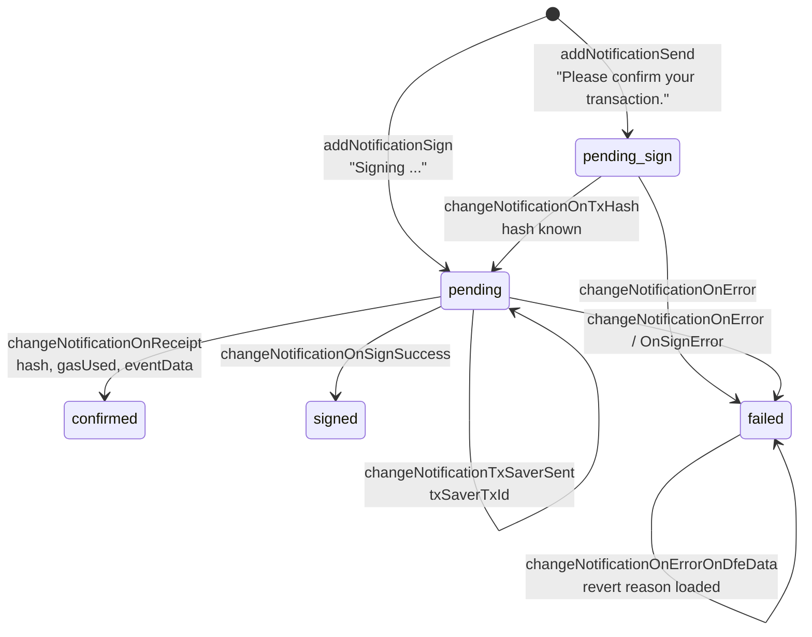
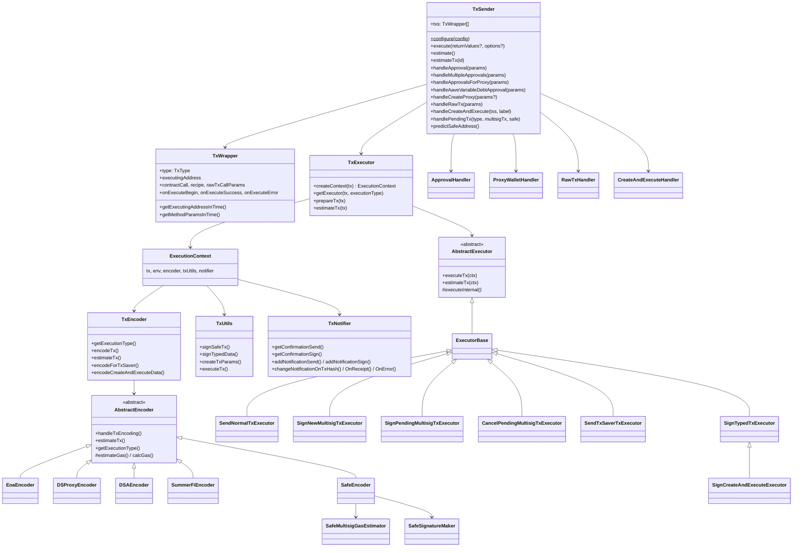

# @defisaver/tx-sender

Provider-agnostic transaction orchestration for DeFi Saver.

`TxSender` takes a queue of transactions, works out how each one must be executed for the connected wallet (EOA, Safe 1/1, Safe m/n, DSProxy, Instadapp DSA, Summer.fi), estimates gas, asks the user to confirm, signs or sends, waits for the receipt and drives notifications along the way. It also handles ERC-20 / ERC-721 approvals, Safe smart-wallet creation, create-and-execute in one tx, TxSaver (relayed, fee-from-position txs) and EIP-5792 batching.

The SDK contains no React, no Redux and no `window`. Everything app-specific is injected through a small set of interfaces, so it works with viem, web3.js, ethers or anything else that can read from a node and sign with a wallet.

- [Install](#install)
- [Quick start](#quick-start)
- [Architecture](#architecture)
  - [Layers](#layers)
  - [Execution sequence](#execution-sequence)
  - [Encoder routing](#encoder-routing)
  - [Executor selection](#executor-selection)
  - [Safe multisig lifecycle](#safe-multisig-lifecycle)
  - [TxSaver flow](#txsaver-flow)
  - [Notification state machine](#notification-state-machine)
  - [Class overview](#class-overview)
- [Configuration](#configuration)
  - [ChainAdapter](#chainadapter)
  - [StateProvider](#stateprovider)
  - [UiAdapter](#uiadapter)
  - [Backend (api)](#backend-api)
  - [TxHooks](#txhooks)
  - [Other options](#other-options)
- [Adapters](#adapters)
- [TxWrapper](#txwrapper)
- [Handlers](#handlers)
- [Errors](#errors)
- [Migrating from defisaver-app](#migrating-from-defisaver-app)
- [Development](#development)

## Install

```bash
npm install @defisaver/tx-sender
```

Peer requirements: Node 18+ or a modern browser (uses `fetch` and `AbortSignal.timeout`). `viem` is a dependency and is used internally for ABI encoding, hashing and signature recovery; it is **not** required as the wallet library. The package ships no wallet-library adapters: you implement `ChainAdapter` for whatever you use (viem, web3, ethers). Reference implementations for viem and web3 live in [`examples/adapters`](examples/adapters) and can be copied into your app.

## Quick start

```ts
import { TxSender, TxWrapper, TxType, abi } from '@defisaver/tx-sender';
import { createViemAdapter } from './adapters/viem'; // copied from examples/adapters

TxSender.configure({
  chain: createViemAdapter({ publicClient, walletClient }),
  state: {
    getNetwork: () => 1,
    getAccount: () => walletClient.account.address,
    getAccountType: () => 'Browser',
    getProxyAddress: () => selectedSmartWallet?.address ?? '',
    getSmartWallets: () => smartWallets,
  },
  ui: myUiAdapter,          // confirm dialogs + notification list, see UiAdapter below
  api: { apiUrl: 'https://app.defisaver.com' },   // DeFi Saver backend, used for Safe multisig and TxSaver
});

const approve = new TxWrapper(TxType.Normal, {
  title: 'Approve DAI',
  protocol: 'maker',
  executingAddress: account,
  contractCallParams: {
    address: DAI,
    abi: abi.erc20Abi,
    method: 'approve',
    methodParams: [spender, amountWei],
  },
});

const sender = new TxSender([approve]);
const [receipt] = await sender.execute();
```

A recipe through the user's smart wallet looks the same, except the tx carries a recipe builder instead of a contract call:

```ts
const boost = new TxWrapper(TxType.Normal, {
  title: 'Boost',
  protocol: 'aave',
  executingAddress: () => state.getProxyAddress(),   // resolved at execution time
  recipe: (swapSourcesBlacklist, swapOrders) => buildBoostRecipe(..., swapSourcesBlacklist, swapOrders),
  shouldCheckEstimate: true,                          // enables the swap-route retry loop
  enableTxSaver: true,
});
await new TxSender([boost]).execute();
```

## Architecture

### Layers

The host app sits on the outside and provides three things: a way to talk to the chain, a view of its own state, and a UI surface. The SDK sits in the middle and never reaches past those interfaces. Talking to the DeFi Saver backend is the SDK's own job; the app only supplies the URLs.



Dependency direction is strictly inward: `src/core`, `src/handlers` and `src/services` import only from `src/interfaces`, `src/types`, `src/config` and viem's pure utilities. No code under `src` touches a wallet library; that is the host app's job through `ChainAdapter`.

### Execution sequence

What happens for a single `TxType.Normal` tx sent from an EOA or a 1/1 Safe. Every other flow is a variation on this skeleton.



On any error the executor converts it to a `TxError`, updates the notification to `failed` (optionally enriching it with `api.getTxErrorData`), calls `tx.onExecuteError(err)` and rethrows. `TxSender.execute` then calls `onQueueEnd` immediately and rethrows.

### Encoder routing

`TxEncoder.encodeTx()` decides how a `TxWrapper` becomes calldata. The first question is always *who executes*: if the executing address is the connected account the call is direct, otherwise it goes through the smart wallet found in `StateProvider.getSmartWallets()`.



Every `Send` path ends with gas estimation (`AbstractEncoder.estimateGas`): the node's estimate is multiplied by 1.2 below 500k gas or 1.1 above, plus the tx's `extraGas`, floored at `minGas`. A failed estimate does not abort; it yields `failing: true` with a 4M gas placeholder so the confirm dialog can show the failure (and `insufficientFunds: true` when the node says the wallet cannot cover gas).

Before returning, send encoders verify that `from` and `to` are valid addresses with code, and that the wallet is on the app's network (`ChainAdapter.getChainId()` vs `StateProvider.getNetwork()`).

### Executor selection

`TxExecutor.getExecutor` maps a `TxType` and the encoder's `ExecutionType` to a flow:

| TxType | ExecutionType | Executor | What it does |
|---|---|---|---|
| `Normal` | `Send` | `SendNormalTxExecutor` | encode → confirm → send → receipt |
| `Normal` | `Sign` | `SignNewMultisigTxExecutor` | encode → confirm → sign Safe hash → `api.postSafeTx` |
| `Raw` | `Send` | `SendNormalTxExecutor` | same as Normal, calldata supplied by caller (direct, or `CALL` through a 1/1 Safe) |
| `Raw` | `Sign` | `SignNewMultisigTxExecutor` | caller calldata as a `CALL` Safe tx on an m/n Safe |
| `ExecutePendingTx` | `Send` | `SendNormalTxExecutor` | concatenate collected signatures → `execTransaction` |
| `SignPendingTx` | `Sign` | `SignPendingMultisigTxExecutor` | sign existing hash → `api.postSafeSignature` |
| `CancelPendingTx` | `Sign` | `CancelPendingMultisigTxExecutor` | sign empty self-call with same nonce → `api.cancelPendingTx` |
| `ExecutePendingTxSaverTx` | `Sign` | `SendTxSaverTxExecutor` | final signature → `api.submitTxToTxSaver` → poll status |
| `TypedSignature` | – | `SignTypedTxExecutor` | EIP-712 signature → `SignatureStore` + `hooks.onSignature` |
| `SignForCreateAndExecute` | – | `SignCreateAndExecuteExecutor` | Safe tx (nonce 0) for a Safe that does not exist yet |

All executors extend `ExecutorBase`, which supplies error handling and the TxSaver eligibility check, which in turn extends `AbstractExecutor`, which owns the retry loop:



### Safe multisig lifecycle

An m/n Safe tx lives in the DeFi Saver backend between the first and the last signature. The SDK touches it at three points, each a separate `TxWrapper` queued with `TxSender.handlePendingTx`.

```mermaid
stateDiagram-v2
  [*] --> Encoded: TxType.Normal on an m/n Safe<br/>(SafeEncoder returns EncoderSignRet)
  Encoded --> Pending: SignNewMultisigTxExecutor<br/>owner 1 signs, api.postSafeTx
  Pending --> Pending: SignPendingMultisigTxExecutor<br/>owner k signs, api.postSafeSignature
  Pending --> Executed: ExecutePendingTx<br/>enough signatures collected,<br/>sender adds pre-approved sig,<br/>Safe.execTransaction
  Pending --> Cancelled: CancelPendingTx<br/>empty self-call, same nonce,<br/>api.cancelPendingTx
  Pending --> Relayed: ExecutePendingTxSaverTx<br/>last owner signs, TxSaver submits
  Executed --> [*]
  Cancelled --> [*]
  Relayed --> [*]
```



Signature handling follows Safe's rules (`SafeSignatureMaker`):

- Typed-data signatures (`eth_signTypedData_v4`) are preferred. If the wallet rejects EIP-712, `TxUtils.signSafeTx` falls back to `personal_sign` over the tx hash.
- `V` is normalised to 27/28. For `personal_sign` the signer is recovered to detect whether the wallet applied the EIP-191 prefix; if it did, `V` is bumped by 4 (31/32) so the Safe verifies it as a prefixed message.
- Signatures are concatenated sorted by signer address, as `checkNSignatures` requires.
- A *pre-approved* signature (`r = signer, s = 0, v = 1`) is used when the executing owner is also the sender. That is how 1/1 Safes send without any signing prompt.

Gas for an unsigned Safe tx is simulated through `SimulateTxAccessor.simulate` called via `Safe.simulateAndRevert` inside a multicall (Safe >= 1.3.0), or `requiredTxGas` on older Safes, plus a 64k execution overhead. The exact gas is re-estimated once the tx is sendable.

### TxSaver flow

TxSaver lets a Safe owner sign instead of send: DeFi Saver's relayer broadcasts the tx and takes its gas cost from the position's sell amount. It is offered in the confirm dialog when the executing wallet is a Safe, the tx value is 0, the recipe has exactly one fixed-amount sell and (if `hooks.getAssetPriceUsd` is set) the sell is worth at least `txSaver.minSellUsdL1` / `minSellUsdL2`.



### Notification state machine

`TxNotifier` owns *when* a notification changes and *what* it says; `UiAdapter` only renders. One notification per tx, keyed by `ui.createNotificationId(tx)`.



`status` values passed to `UiAdapter.changeNotification` are `pending-sign`, `pending`, `confirmed`, `signed`, `failed` and, for batches, `success`.

### Class overview



## Configuration

`TxSender.configure(config)` sets a process-wide default; `new TxSender(txs, config)` overrides it per instance. `resolveConfig` fills in defaults for everything optional.

```ts
interface TxSenderConfig {
  chain: ChainAdapter;          // required
  state: StateProvider;         // required
  ui: UiAdapter;                // required
  api: DfsApiOptions;           // required: { apiUrl, safeApiUrl?, timeoutMs?, fetch? }
  hooks?: TxHooks;
  logger?: Logger;              // default: console
  messages?: Partial<Messages>; // user-visible strings
  addresses?: AddressOverrides; // per-network contract overrides
  gasPriceProvider?: GasPriceProvider;
  approveTypeLabels?: Record<string, string>;
  tokensNeedReapprove?: string[];
  tenderly?: { account: string; project: string };
  debug?: boolean;
  signatures?: SignatureStore;
  txSaver?: { minSellUsdL1?: number; minSellUsdL2?: number };
}
```

### ChainAdapter

The only path to the blockchain. Reads can go to any RPC (including a Tenderly fork); signing goes to the user's wallet. The app implements it for its wallet library; see [Adapters](#adapters) for reference implementations.

```ts
interface ChainAdapter {
  getChainId(): Promise<number>;                                // wallet's chain, compared to state.getNetwork()
  getCode(address): Promise<string>;
  getGasPrice(): Promise<string>;                               // wei
  getLatestBaseFee(): Promise<string | undefined>;              // wei
  call(req: CallRequest): Promise<Hex>;
  estimateGas(req: CallRequest): Promise<number>;
  getTransactionReceipt(hash): Promise<TxReceipt | null>;
  sendTransaction(params: FinalTxParams, onTxHash: (hash) => Promise<void>): Promise<TxReceipt>;
  signMessage(message, signer): Promise<Hex>;                   // personal_sign
  signTypedData(typedData: EIP712TypedData, signer): Promise<Hex>; // eth_signTypedData_v4
  sendCalls?(req: SendCallsRequest): Promise<unknown>;          // EIP-5792, only for batching
  signSafeTx?(req: SignSafeTxRequest): Promise<SignatureData>;  // override Safe signing (e.g. local keys on forks)
}
```

`sendTransaction` must resolve with the mined receipt and reject with the underlying error. If the tx mined but reverted, attach the receipt to the error as `error.receipt`. `FinalTxParams` is either type-2 (`type: '0x2'`, `maxFeePerGas`, `maxPriorityFeePerGas` as hex) or legacy (`gasPrice` as hex); never both.

`TxReceipt` is the SDK's normalised receipt: `{ transactionHash, status: boolean, gasUsed: number, blockNumber, from, to, logs, txId?, events? }`.

### StateProvider

Read-only view of the app's state. All methods are synchronous and are called at execution time, so the values can change between queueing and executing a tx.

```ts
interface StateProvider {
  getNetwork(): NetworkNumber;
  getAccount(): EthereumAddress;
  getAccountType(): AccountType;     // Fork, GnosisSafe and ViewOnly change behaviour
  getProxyAddress(): EthereumAddress; // selected smart wallet or ''
  getSmartWallets(): AnyProxyWallet[];
  getForkId?(): string | undefined;   // forwarded to backend calls
}
```

`AccountType` effects:

| Value | Effect |
|---|---|
| `ViewOnly` | `execute` / `estimate` throw `messages.viewOnlyMode` |
| `GnosisSafe` | Connected through a Safe app: the confirm dialog is skipped and the Safe UI sets gas |
| `Fork` | No TxSaver, no revert-reason lookup, base fee floored to a per-network minimum |

### UiAdapter

Renders what the SDK asks for. The SDK decides the text and the status; the app decides the look.

```ts
interface UiAdapter {
  createNotificationId(tx: TxWrapper): string;
  confirmSend(data: TxConfirmData): Promise<TxConfirmDataResolved>;
  confirmSign(data: TxSignConfirmData): Promise<TxConfirmDataFromSignResolved>;
  confirmBatch?(data: TxConfirmBatchData): Promise<boolean>;
  confirmDialog?(message: string): Promise<boolean>;   // high gas price warning
  addNotification(payload: NotificationPayload): void;
  changeNotification(id: string, changes: NotificationUpdate): void;
}
```

`confirmSend` must resolve with one of:

| Value | Meaning |
|---|---|
| `false` | user cancelled → `TxError(messages.userCanceled)` |
| `{ failed: true }` | dialog detected a failing estimate and asked to retry → tx is re-encoded and prompted again |
| `ConfirmationRet` | `{ isTxSaver: false, gasPrice, gasLimit, maxFee, priorityFee, isType2, approve? }` (gwei strings) |
| `TxSaverConfirmationRet` | `{ isTxSaver: true, maxFee, feeToken, tokenPriceInEth, gasEstimate, nonce?, useCustomNonce? }` |

For exact approvals (`TxConfirmData.isExactApproval`), resolving with `approve: MAXUINT` switches the tx to an unlimited approval. `confirmSign` resolves with `true` to proceed, `false` to cancel, or one of the object forms above (a custom `nonce` re-encodes the Safe tx).

### Backend (api)

The DeFi Saver backend calls are built into the SDK (`DfsApi` class) because the Safe multisig and TxSaver flows cannot work without them. The app only configures where the backend lives:

```ts
api: {
  apiUrl: 'https://app.defisaver.com',   // TxSaver submit / status, tx-error lookup
  safeApiUrl?: string,                   // Safe nonce / tx / signature / cancel; defaults to apiUrl
  timeoutMs?: number,                    // per request, default 30 000
  fetch?: typeof fetch,                  // override to add headers or in tests
}
```

Endpoints used: `GET /safe/nonce`, `POST /safe/tx`, `POST /safe/signature`, `POST /safe/tx/cancel`, `POST /api/txsaver/submit`, `GET /api/txsaver/status`, `GET /api/tx-error/:hash`. The resolved config exposes the instance as `config.api` if you need to call them directly.

### TxHooks

Optional side-effect callbacks. These replace the Redux dispatches the original implementation performed.

| Hook | Fired when | Typical use |
|---|---|---|
| `onQueueStart(txs)` | `execute()` begins | show "1 of N" progress |
| `onQueueProgress(done, total)` | after each tx | advance progress |
| `onQueueEnd()` | 5 s after success, or immediately on error | hide progress |
| `onTxHash(hash, tx)` | tx hash known (awaited) | register tx with backend, pending-tx tracking |
| `onTxMined(hash, tx)` | receipt confirmed | store last mined tx, refresh balances |
| `onTxPrompt(confirmData, encoding)` | before a confirm dialog | analytics (`txPromptOk` / `txPromptFailing`) |
| `onSignature({ protocol, actionName, signature, sigType }, tx)` | EIP-712 signature produced | mirror into app state |
| `onSafeTxData(safeTx, tx)` | create-and-execute Safe tx signed | mirror into app state |
| `onApproval({ phase, asset, approveType, spender, isRevoke, error? }, tx)` | approve tx begins / succeeds / fails | approval reducers |
| `onSmartWalletCreated(wallet, receipt, { changeWallet })` | Safe created | add to wallet list, localStorage, analytics, select it |
| `onSelectProxyWallet(address)` | create-and-execute needs a different active wallet | update selection |
| `parseReceiptEvents(receipt, tx, network)` | after a receipt | parse DFS swap / fee events for the notification |
| `getAssetPriceUsd(symbol, network)` | before offering TxSaver | enforce the minimum sell size |

### Other options

- **`gasPriceProvider(network, isFork)`** returns `{ baseFee, priorityFee }` in gwei and is used only for the gas price attached to `eth_estimateGas` calls. The default reads the latest block's base fee and adds a static tip; apps with a gas oracle should override it. On failure the SDK falls back to `eth_gasPrice`, then to 1 gwei.
- **`messages`** overrides any user-facing string (see `DEFAULT_MESSAGES`). Placeholders: `%txHash`, `%txhash`, `%network`, `%gasPrice`.
- **`addresses`** overrides `DEFAULT_ADDRESSES` per network: Safe 1.3.0 singleton / factory / fallback handler, `SimulateTxAccessor`, Uniswap-style multicall and `DFSSafeFactory`.
- **`approveTypeLabels`** maps `approveType` keys (e.g. `'Smart Wallet'`) to display labels used in approval titles; defaults to the key itself.
- **`tokensNeedReapprove`** lists mainnet tokens that must be reset to 0 before a new non-zero approval (USDT and friends).
- **`signatures`** is the `SignatureStore` that links `TypedSignature` txs to later txs in the same queue (create-and-execute). One shared instance is created by default.
- **`debug`** logs every encoding through `logger.debug`, with a Tenderly simulation link when `tenderly` is set.

## Adapters

The SDK does not ship or export wallet-library adapters. The app that installs it owns that code, which keeps the package free of opinions about wallet libraries and their versions. Two reference implementations are kept in [`examples/adapters`](examples/adapters) and typechecked against `src` so they cannot drift from the `ChainAdapter` interface. Copy one into your app and adjust it.

### `examples/adapters/viem.ts`

```ts
const chain = createViemAdapter({ publicClient, walletClient });
```

`publicClient` handles reads (point it at a fork RPC if needed), `walletClient` must have an account attached. Typed data is signed with `walletClient.signTypedData`; viem derives `EIP712Domain` from `domain` so it is stripped from `types`. `sendCalls` issues `wallet_sendCalls` through `walletClient.request`.

### `examples/adapters/web3.ts`

```ts
const chain = createWeb3Adapter({ web3: rpcWeb3, web3Signer: walletWeb3 });
```

Works with web3 v1 and v4 (typed structurally, so it does not pull web3 in as a dependency). The same file has `fromWeb3Contract(contract, method, params?, ethValue?)`, which turns a web3 `Contract` into `ContractCallParams` so existing call sites keep their contract instances.

### Writing your own

Implement `ChainAdapter`. The only subtle method is `sendTransaction`: call `onTxHash` as soon as the hash is known and await it before resolving, resolve with the normalised receipt, reject with the raw error. For forks or test accounts, implement the optional `signSafeTx` to sign locally instead of prompting the wallet.

## TxWrapper

A `TxWrapper` describes one unit of work. Fields can be static values or functions (`TxWParam<T>`), resolved when the tx executes so values computed by earlier txs (a freshly created Safe, a signature) are picked up.

```ts
new TxWrapper(type: TxType, {
  title, protocol, category, additionalInfo,   // display + notification metadata
  executingAddress,                             // account (direct) or smart wallet (proxied)
  contractCallParams: { address, abi, method, methodParams, ethValue },
  recipe: (blacklist, orders) => Promise<Recipe>, // @defisaver/sdk Recipe
  rawTxCallParams: { from, to, data },          // TxType.Raw only
  ethValue, minGas, extraGas,
  isExactApproval, forceExecuteAsRecipe,
  shouldCheckEstimate,                          // pre-estimate + swap-route retry
  enableTxSaver,
  nonce,                                        // explicit Safe nonce
  signaturePrimaryType, signatureDomainType, signatureInfo, // TxType.TypedSignature
  pendingTxData,                                // pending Safe tx types
  onExecuteBegin, onExecuteSuccess, onExecuteError, onTxHashCallback,
  addSuffix,                                    // append DeFi Saver calldata marker
})
```

`method` may be a plain name or a full signature such as `execute(address,bytes)` to pin an overload.

`TxType.Raw` carries `rawTxCallParams` instead of a contract call or recipe and is easiest to create through `sender.handleRawTx(...)`. Recipes and contract calls go through smart wallets as `delegatecall`s; raw calldata is relayed as a plain `CALL` (`SafeOperation.Call`), which is why only the account and Safes can execute it.

Pending Safe txs are queued with `sender.handlePendingTx(type, multisigTx, safeAddress)`, which builds the wrapper from a backend `MultisigTx`.

## Handlers

`TxSender` exposes the handlers that build common txs onto its queue.

| Method | Builds |
|---|---|
| `handleApproval({ isSpenderProxy, asset, spender, amount, shouldBump, approveType, useMaxuint?, assetAddress? })` | ERC-20 `approve` when on-chain allowance is below `amount`; a 0-approval first for `tokensNeedReapprove` on mainnet. Returns the queued wrappers. |
| `handleAaveVariableDebtApproval(...)` | `approveDelegation` on an Aave variable-debt token when `borrowAllowance` is too low. |
| `handleRawTx({ to, data, value?, title, executingAddress?, ... })` | A `TxType.Raw` tx with calldata encoded elsewhere (another SDK, a backend, a quote API). From the account it is sent as-is; with a Safe as `executingAddress` it is relayed through `execTransaction` as a plain `CALL` (1/1 sends, m/n goes through the multisig signing flow). DSProxy, DSA and Summer.fi only `delegatecall`, so they are rejected. Returns the queued wrapper. |
| `handleMultipleApprovals({ approvals, approvalTokenAmounts, onApprovalsBegin, onApprovalsSuccess, onApprovalsError })` | Approvals for everything a recipe reports via `recipe.getAssetsToApprove()` (ERC-20 and ERC-721), owned by the account, for the selected smart wallet. The hooks are attached only when something was queued. |
| `handleApprovalsForProxy({ ..., spender, title, buildRecipe? })` | One recipe tx from the smart wallet approving `spender`. `buildRecipe` lets the app add extra actions (the DeFi Saver app appends strategy unsubscribes). |
| `handleCreateProxy({ onExecuteBegin?, onExecuteSuccess?, onExecuteError?, changeWallet? })` | `SafeProxyFactory.createProxyWithNonce` for a 1/1 Safe with a deterministic salt (`'DeFi Saver'` + sequential nonce, skipping salts whose address already has code). On success parses the `ProxyCreation` log and fires `hooks.onSmartWalletCreated`. |
| `predictSafeAddress()` | CREATE2 address the next `handleCreateProxy` would deploy to. |
| `handleCreateAndExecute(txBuilders, label)` | Picks the executing wallet: the selected one if it is a known non-multisig wallet, else any 1/1 Safe or DSProxy, else a predicted Safe. In the last case appends a `DFSSafeFactory.createSafeAndExecute` tx that reads the signature produced by a preceding `SignForCreateAndExecute` tx from the `SignatureStore`. |

The create-and-execute builders receive `{ proxyForExecution, useCreateAndExecute }` so they can target the right wallet and choose `TxType.SignForCreateAndExecute` when the Safe does not exist yet.

## Errors

Every failure surfaces as a `TxError` with:

- `message` mapped to a friendly string: wallet rejections become `messages.deniedTransaction`, reverts become `messages.revertedTransaction` with the hash;
- `notificationId` of the affected notification;
- `txHash` / `hash` when a tx was broadcast;
- `txTakingTooLong` when web3 gave up waiting for the receipt;
- `forkTxId` for Tenderly fork simulations.

## Migrating from defisaver-app

The public surface is intentionally close to `client/src/txSender`, so most call sites change mechanically.

| Before | After |
|---|---|
| `TxSender.injectTxExecutor(DfsTxExecutor)`, `DfsStateProvider.injectRedux(dispatch, getState)` | `TxSender.configure({ chain, state, ui, api, hooks, ... })` once at bootstrap |
| `new TxSender(dispatch, getState, txs)` | `new TxSender(txs)` |
| `contractCallParams: { contract: getErc20(addr), method, methodParams }` | `contractCallParams: { address, abi, method, methodParams }`, or `fromWeb3Contract(getErc20(addr), method, methodParams)` from the web3 example adapter |
| `txSender.handleApproval(isSpenderProxy, asset, spender, amount, shouldBump, approveType, useMaxuint, assetAddress)` | `txSender.handleApproval({ isSpenderProxy, asset, spender, amount, shouldBump, approveType, useMaxuint, assetAddress })` |
| `txSender.handleCreateProxy({ onExecuteSuccess })` | unchanged; wallet-list / localStorage / analytics work moves to `hooks.onSmartWalletCreated` |
| `execute(returnValues, enableEip7702)` | `execute(returnValues, { batch: enableEip7702 })` |
| `window._web3`, `window._web3Signer` | a `ChainAdapter` implemented in the app, e.g. the web3 example adapter with `{ web3, web3Signer }` |
| `DfsTxNotifier` (dispatches `addNotification`, `confirmTx`, ...) | `UiAdapter` implemented with those same dispatches |
| `registerTx`, `storeLastMinedTx`, `SIGNATURE_REDUCER` dispatches | `hooks.onTxHash`, `hooks.onTxMined`, `hooks.onSignature` / `onSafeTxData` |
| `APPROVE_ADDRESS_ON_ASSET_*` dispatches | `hooks.onApproval` |
| `getEip1559GasData` (Blocknative) | `gasPriceProvider` |
| `parseSwapsFromReceipts`, `parseAllFeesFromReceipts` | `hooks.parseReceiptEvents` |
| `t('errors.user_canceled')` etc. | `messages` |
| `testAccs` local signing on forks | `chain.signSafeTx` / `signTypedData` in a fork-aware adapter |
| `services/apiServices` Safe + TxSaver calls | built in; pass `api: { apiUrl, safeApiUrl }` from `clientConfig.json` |

Behavioural notes:

- `TxWrapper.contract` is replaced by `contractCall` (`{ address, abi, method, methodParams }`); `getContract()` is now `getContractCall()`.
- Receipts are normalised `TxReceipt`s. The adapter decides what to preserve; the web3 example keeps web3's `events` and fork `txId`.
- `SafeSignatureMaker.adjustVInSig` and `encodeSafeSignatures` are async (signature recovery uses viem's async API).
- The swap-route retry loop reads `recipe.swap` with the same fields the app's `Swap` class exposes (`lastFoundExchangeSource`, `price`, `lastFoundPrice`, `amount`, `fromTokenData`, `toTokenData`, `fetchedSwapOrders`).

## Development

```bash
npm install
cp .env.example .env                 # fill in TEST_PRIVATE_KEY (any throwaway key)
npm run lint                         # eslint src/ --fix (@defisaver/eslint-config)
npm run typecheck                    # tsc --noEmit over src, tests and examples
npm test                             # mocha tests/*
npm run test-single --name=txSender  # one file (POSIX shell; on Windows run `npx mocha tests/txSender.ts`)
npm run build                        # lint, then tsc → cjs/ and esm/ (same layout as @defisaver/positions-sdk)
```

Tests use mocha + chai with sinon for stubs, loaded through `ts-node/register`, and run against in-memory adapters in `tests/utils/mocks.ts`; no network access is needed. Secrets such as the signing key come from `.env` (git-ignored, see `.env.example`); tests that need a missing secret are skipped rather than failed. `examples/` is typechecked but not published. See `CLAUDE.md` for repository conventions.

### Publishing

The process mirrors `@defisaver/positions-sdk`:

- **Package layout:** `main` → `cjs/index.js`, `module` → `esm/index.js`, `types` → `esm/index.d.ts`. Both trees are plain `tsc` output (`tsconfig.cjs.json`, `tsconfig.esm.json`), no bundler. `.npmignore` keeps tests, examples, configs and workflows out of the tarball.
- **Production release:** run the *PROD - npm publish* GitHub workflow on `main`. It bumps the patch version with `npm version patch`, commits and pushes the tag, builds and publishes with the `NPM_AUTH_TOKEN` secret. Locally, `npm run version-bump` does the same bump-and-commit without publishing.
- **Dev release:** run *DEV - npm publish* with a version input; it publishes `<version>-dev` under the `dev` dist-tag without touching git.
- **CI:** the *Tests* workflow runs lint, typecheck and mocha on every PR and on pushes to `main`, with `TEST_PRIVATE_KEY` and RPC URLs supplied as repository secrets.
